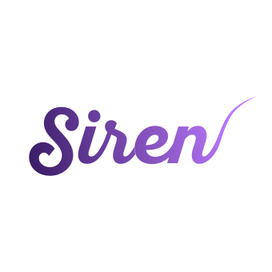

# Siren: OSS 静态站

### 基本结构

* 首页
* News 新闻页
* Projects 项目介绍页
* Mirror 镜像站
* Members 成员页面
* Archive 存档
* .hide 独立页面（纳新，SFD等活动，不在导航栏里展示，但是留下入口）

### TODOS:
*由于我时间有限，下面这些问题需要大家一起来解决：*

* 基本文字介绍
* 成员信息填充
* 项目图标需要设计
* 社区 Logo 需要确定
* 各个页面之间的跳转
* Archive 页面需要被重新设计以使其适应新风格（工程量较大）
* 页脚 页首处的 Logo 需要载入
* 移动端下滑后的 fix navbar 需要取消掉
* *Open Whisper* 小留言板项目： 具体可以再讨论

### Reference

* http://www.semantic-ui.cn/examples/homepage.html

